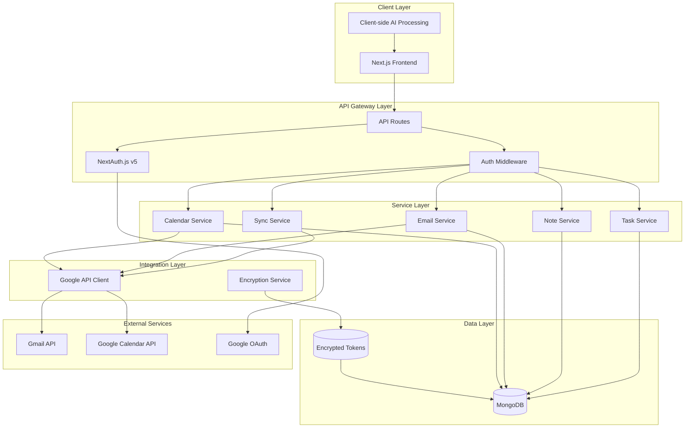

# Design Document: Dashly API Routes

## Overview

Dashly is a privacy-first productivity dashboard that serves as a secure gateway between users and their Google services (Gmail, Calendar) while maintaining strict data privacy through client-side AI processing. The system architecture follows a three-tier approach: presentation layer (Next.js frontend), API gateway layer (Next.js API routes), and data persistence layer (MongoDB with encrypted OAuth tokens).

The design emphasizes security through OAuth token encryption, user data isolation, and comprehensive error handling while providing seamless integration with Google APIs through automated token refresh and resilient sync operations.

## Architecture

### System Architecture



### Component Interaction Flow

1. **Authentication Flow**: User authenticates via Google OAuth → NextAuth.js stores encrypted tokens → Session established
2. **API Request Flow**: Frontend → API Route → Auth Middleware → Service Layer → MongoDB/Google APIs
3. **Sync Flow**: Sync Service → Google API Client → Token Refresh (if needed) → Data Processing → MongoDB Storage
4. **Privacy Flow**: All AI processing remains in browser → No sensitive data sent to server for AI analysis

## Components and Interfaces

### Core Models

#### User Model
```typescript
interface IUser {
  _id: ObjectId;
  email: string;
  name?: string;
  picture?: string;
  googleId: string;
  createdAt: Date;
  updatedAt: Date;
}
```

#### OAuth Token Model (Encrypted)
```typescript
interface IOAuthToken {
  _id: ObjectId;
  userId: ObjectId;
  provider: 'google';
  accessToken: string;        // AES-256-GCM encrypted
  refreshToken: string;       // AES-256-GCM encrypted
  expiresAt: Date;
  scopes: string[];
  createdAt: Date;
  updatedAt: Date;
}
```

#### Task Model
```typescript
interface ITask {
  _id: ObjectId;
  userId: ObjectId;
  title: string;
  description?: string;
  status: 'todo' | 'in_progress' | 'done';
  priority: 'low' | 'medium' | 'high';
  dueDate?: Date;
  tags: string[];
  linkedEmailId?: ObjectId;
  linkedNoteId?: ObjectId;
  linkedCalendarEventId?: string;
  createdAt: Date;
  updatedAt: Date;
}
```

#### Note Model
```typescript
interface INote {
  _id: ObjectId;
  userId: ObjectId;
  title: string;
  content: string;              // Markdown/Rich text
  tags: string[];
  linkedTaskIds: ObjectId[];
  createdAt: Date;
  updatedAt: Date;
}
```

#### Email Model
```typescript
interface IEmail {
  _id: ObjectId;
  userId: ObjectId;
  gmailId: string;              // Unique Gmail message ID
  threadId: string;
  from: string;
  to: string[];
  subject: string;
  snippet: string;
  body?: string;                // Optional full body
  isRead: boolean;
  isStarred: boolean;
  labels: string[];
  receivedAt: Date;
  linkedTaskId?: ObjectId;
  createdAt: Date;
  updatedAt: Date;
}
```

#### Calendar Event Model
```typescript
interface ICalendarEvent {
  _id: ObjectId;
  userId: ObjectId;
  googleEventId: string;        // Google Calendar Event ID
  title: string;
  description?: string;
  startTime: Date;
  endTime: Date;
  location?: string;
  attendees: string[];
  linkedTaskId?: ObjectId;
  createdAt: Date;
  updatedAt: Date;
}
```

### Service Interfaces

#### Authentication Service
```typescript
interface IAuthService {
  getCurrentUser(req: NextRequest): Promise<IUser | null>;
  requireAuth(req: NextRequest): Promise<IUser>;
  refreshTokenIfNeeded(userId: ObjectId): Promise<void>;
}
```

#### Google API Service
```typescript
interface IGoogleService {
  getGmailClient(userId: ObjectId): Promise<gmail_v1.Gmail>;
  getCalendarClient(userId: ObjectId): Promise<calendar_v3.Calendar>;
  refreshTokenIfNeeded(userId: ObjectId): Promise<boolean>;
}
```

#### Encryption Service
```typescript
interface ICryptoService {
  encrypt(text: string): string;
  decrypt(encrypted: string): string;
  generateKey(): string;
}
```

#### Sync Service
```typescript
interface ISyncService {
  syncGmail(userId: ObjectId, maxResults?: number): Promise<SyncResult>;
  syncCalendar(userId: ObjectId, startDate?: Date, endDate?: Date): Promise<SyncResult>;
}

interface SyncResult {
  synced: number;
  errors: number;
  timestamp: Date;
}
```

### API Route Structure

#### Authentication Routes
- `POST /api/auth/signin` - Google OAuth signin
- `POST /api/auth/signout` - User signout
- `GET /api/auth/session` - Get current session

#### Health Check
- `GET /api/health` - System health status

#### Task Management
- `GET /api/tasks` - List user tasks (with filtering)
- `POST /api/tasks` - Create new task
- `GET /api/tasks/[id]` - Get specific task
- `PATCH /api/tasks/[id]` - Update task
- `DELETE /api/tasks/[id]` - Delete task

#### Note Management
- `GET /api/notes` - List user notes
- `POST /api/notes` - Create new note
- `GET /api/notes/[id]` - Get specific note
- `PATCH /api/notes/[id]` - Update note
- `DELETE /api/notes/[id]` - Delete note

#### Email Management
- `GET /api/emails` - List user emails (with filtering)
- `GET /api/emails/[id]` - Get specific email
- `PATCH /api/emails/[id]` - Update email metadata
- `DELETE /api/emails/[id]` - Delete email

#### Gmail Integration
- `POST /api/gmail/sync` - Sync Gmail inbox
- `PATCH /api/gmail/read` - Mark email as read/unread

#### Calendar Integration
- `POST /api/calendar/sync` - Sync Google Calendar
- `POST /api/calendar/create` - Create calendar event

## Data Models

### Database Schema Design

#### Indexing Strategy
```typescript
// User collection indexes
db.users.createIndex({ "googleId": 1 }, { unique: true });
db.users.createIndex({ "email": 1 }, { unique: true });

// OAuth tokens indexes
db.oauthtokens.createIndex({ "userId": 1, "provider": 1 }, { unique: true });

// Task collection indexes
db.tasks.createIndex({ "userId": 1 });
db.tasks.createIndex({ "userId": 1, "status": 1 });
db.tasks.createIndex({ "userId": 1, "dueDate": 1 });

// Note collection indexes
db.notes.createIndex({ "userId": 1 });
db.notes.createIndex({ "userId": 1, "tags": 1 });

// Email collection indexes
db.emails.createIndex({ "userId": 1 });
db.emails.createIndex({ "userId": 1, "gmailId": 1 }, { unique: true });
db.emails.createIndex({ "userId": 1, "isRead": 1 });
db.emails.createIndex({ "userId": 1, "receivedAt": -1 });

// Calendar event indexes
db.calendarevents.createIndex({ "userId": 1 });
db.calendarevents.createIndex({ "userId": 1, "googleEventId": 1 }, { unique: true });
db.calendarevents.createIndex({ "userId": 1, "startTime": 1 });
```

#### Data Relationships
- **User → OAuth Tokens**: One-to-many (user can have multiple provider tokens)
- **User → Tasks**: One-to-many with ownership isolation
- **User → Notes**: One-to-many with ownership isolation
- **User → Emails**: One-to-many with ownership isolation
- **User → Calendar Events**: One-to-many with ownership isolation
- **Tasks ↔ Notes**: Many-to-many through linkedTaskIds array
- **Tasks ↔ Emails**: One-to-one through linkedEmailId
- **Tasks ↔ Calendar Events**: One-to-one through linkedCalendarEventId

### Token Encryption Strategy

OAuth tokens are encrypted using AES-256-GCM with the following approach:

```typescript
// Encryption format: iv:authTag:encryptedData (all base64 encoded)
interface EncryptedToken {
  iv: Buffer;           // 12 bytes for GCM
  authTag: Buffer;      // 16 bytes authentication tag
  encrypted: Buffer;    // Variable length encrypted data
}
```

**Security Features:**
- 256-bit encryption key derived from environment variable
- Random initialization vector for each encryption
- Authentication tag prevents tampering
- No salt needed as tokens are not password-derived

## Correctness Properties

*A property is a characteristic or behavior that should hold true across all valid executions of a system—essentially, a formal statement about what the system should do. Properties serve as the bridge between human-readable specifications and machine-verifiable correctness guarantees.*

Based on the prework analysis, here are the testable correctness properties for the Dashly API system:

### Authentication and Security Properties

**Property 1: OAuth Token Encryption Round-trip**
*For any* OAuth token (access or refresh), encrypting then decrypting should produce the original token value
**Validates: Requirements 1.5, 6.1**

**Property 2: Authentication and Ownership Validation**
*For any* protected API endpoint and any user request, the system should verify authentication and ensure users can only access their own data
**Validates: Requirements 1.2, 6.2**

**Property 3: Token Refresh Mechanism**
*For any* user with expired tokens and valid refresh tokens, the OAuth manager should successfully refresh the access token
**Validates: Requirements 1.3**

**Property 4: User Record Management**
*For any* successful OAuth signin, the system should create a new user record or update an existing one based on the Google ID
**Validates: Requirements 1.4**

### Data Synchronization Properties

**Property 5: Gmail Sync Message Limit**
*For any* Gmail sync operation, the system should fetch at most the specified number of messages (default 100)
**Validates: Requirements 2.1**

**Property 6: Gmail Metadata Extraction**
*For any* Gmail message, the sync engine should extract all required metadata fields (id, subject, from, to, snippet, labels, date)
**Validates: Requirements 2.2**

**Property 7: Email Upsert Integrity**
*For any* email with the same gmailId, storing it multiple times should result in updates rather than duplicate records
**Validates: Requirements 2.3**

**Property 8: Email Read Status Consistency**
*For any* email read/unread operation, both Google Gmail and the local database should be updated consistently
**Validates: Requirements 2.4**

**Property 9: Sync Result Accuracy**
*For any* sync operation, the returned counts should match the actual number of items synced and errors encountered
**Validates: Requirements 2.5**

**Property 10: Calendar Date Range Filtering**
*For any* calendar sync with specified date range, only events within that range should be fetched
**Validates: Requirements 3.1**

**Property 11: Calendar Event Data Extraction**
*For any* calendar event, the sync engine should extract all required fields (title, description, start/end times, attendees)
**Validates: Requirements 3.2**

**Property 12: Calendar Event Upsert Integrity**
*For any* calendar event with the same googleEventId, storing it multiple times should result in updates rather than duplicates
**Validates: Requirements 3.3**

**Property 13: Calendar Event Creation Consistency**
*For any* new calendar event creation, records should be created in both Google Calendar and the local database
**Validates: Requirements 3.4**

**Property 14: Sync Error Resilience**
*For any* sync operation with individual item failures, the process should continue and handle partial results gracefully
**Validates: Requirements 3.5, 7.2**

### Task Management Properties

**Property 15: Task Data Completeness**
*For any* task creation with provided fields, all specified data (title, description, status, priority, due date) should be stored and retrievable
**Validates: Requirements 4.1**

**Property 16: Task Filtering Accuracy**
*For any* task list request with filters (status, priority, tags), only tasks matching all specified criteria should be returned
**Validates: Requirements 4.2**

**Property 17: Task Ownership Validation**
*For any* task update operation, users should only be able to modify tasks they own
**Validates: Requirements 4.3**

**Property 18: Task Relationship Integrity**
*For any* task linked to emails or calendar events, the referential relationships should be maintained correctly
**Validates: Requirements 4.4**

**Property 19: Task Status Validation**
*For any* task status update, only valid statuses (todo, in_progress, done) should be accepted
**Validates: Requirements 4.5**

### Note Management Properties

**Property 20: Note Data Completeness**
*For any* note creation, all provided fields (title, content, tags) should be stored and retrievable
**Validates: Requirements 5.1**

**Property 21: Note CRUD Ownership**
*For any* note CRUD operation, users should only be able to access and modify their own notes
**Validates: Requirements 5.2**

**Property 22: Note-Task Bidirectional Linking**
*For any* note linked to a task, both the note's linkedTaskIds and the task's linkedNoteId should be updated correctly
**Validates: Requirements 5.3**

**Property 23: Note Content Preservation**
*For any* note with rich text or Markdown content, the content should be stored and retrieved without corruption
**Validates: Requirements 5.4**

**Property 24: Note Data Isolation**
*For any* user's note listing request, the response should contain only notes belonging to that user
**Validates: Requirements 5.5**

### Error Handling Properties

**Property 25: Safe Error Messages**
*For any* error condition, the error response should not contain sensitive information like tokens or internal system details
**Validates: Requirements 6.4, 7.3**

**Property 26: Standardized Error Responses**
*For any* API error, the response should follow the standard format with appropriate HTTP status codes
**Validates: Requirements 7.1**

**Property 27: Authentication Error Status Codes**
*For any* authentication failure, the system should return 401 for unauthenticated requests and 403 for unauthorized access
**Validates: Requirements 7.4**

**Property 28: Validation Error Responses**
*For any* input validation failure, the system should return 400 status with detailed validation error information
**Validates: Requirements 7.5**

### System Health Properties

**Property 29: Health Check Database Verification**
*For any* health check request, the system should verify and report MongoDB connectivity status
**Validates: Requirements 8.2**

**Property 30: Health Response Completeness**
*For any* health check response, it should contain status, timestamp, and database connection state
**Validates: Requirements 8.3**

### Data Processing Properties

**Property 31: Request Validation**
*For any* API request with a request body, the data should be validated against defined schemas before processing
**Validates: Requirements 9.1**

**Property 32: Response Format Consistency**
*For any* API response, the data should be formatted consistently according to defined TypeScript interfaces
**Validates: Requirements 9.2**

**Property 33: Database Document Parsing**
*For any* MongoDB document, it should be correctly parsed into the corresponding TypeScript interface
**Validates: Requirements 9.3**

**Property 34: Date Format Consistency**
*For any* date value in requests or responses, it should be handled in ISO 8601 format consistently
**Validates: Requirements 9.4**

**Property 35: Input Validation Prevention**
*For any* invalid input data, the validation should prevent it from being stored in the database
**Validates: Requirements 9.5**

<function_calls>
<invoke name="prework">
<parameter name="featureName">dashly-api-routes

## Error Handling

### Error Response Format

All API errors follow a standardized format:

```typescript
interface ErrorResponse {
  error: string;           // Human-readable error message
  code: string;           // Machine-readable error code
  details?: any;          // Additional error context (validation errors, etc.)
}
```

### HTTP Status Code Strategy

- **200 OK**: Successful GET, PATCH operations
- **201 Created**: Successful POST operations
- **400 Bad Request**: Validation errors, malformed requests
- **401 Unauthorized**: Missing or invalid authentication
- **403 Forbidden**: Valid authentication but insufficient permissions
- **404 Not Found**: Resource not found or user doesn't own it
- **429 Too Many Requests**: Rate limiting (future enhancement)
- **500 Internal Server Error**: Unexpected server errors

### Error Handling Patterns

#### Authentication Errors
```typescript
// Missing authentication
{ error: "Authentication required", code: "AUTH_REQUIRED" }

// Invalid token
{ error: "Invalid authentication token", code: "AUTH_INVALID" }

// Insufficient permissions
{ error: "Access denied", code: "ACCESS_DENIED" }
```

#### Validation Errors
```typescript
// Input validation failure
{
  error: "Validation failed",
  code: "VALIDATION_ERROR",
  details: {
    field: "email",
    message: "Invalid email format"
  }
}
```

#### Google API Errors
```typescript
// OAuth token refresh failure
{ error: "Unable to refresh authentication", code: "TOKEN_REFRESH_FAILED" }

// Google API rate limit
{ error: "Service temporarily unavailable", code: "RATE_LIMITED" }

// Google API service error
{ error: "External service error", code: "EXTERNAL_SERVICE_ERROR" }
```

#### Database Errors
```typescript
// Connection failure
{ error: "Service temporarily unavailable", code: "DATABASE_ERROR" }

// Constraint violation
{ error: "Data conflict", code: "CONSTRAINT_VIOLATION" }
```

### Error Logging Strategy

- **Client Errors (4xx)**: Log minimal information for debugging
- **Server Errors (5xx)**: Log full error details including stack traces
- **Security Events**: Log authentication failures and access attempts
- **External API Errors**: Log Google API failures for monitoring

### Graceful Degradation

- **Sync Operations**: Continue processing other items when individual items fail
- **Token Refresh**: Attempt refresh once, then require re-authentication
- **Database Failures**: Return cached data when possible, clear error messages when not
- **Google API Failures**: Provide meaningful user feedback and retry suggestions

## Testing Strategy

### Dual Testing Approach

The Dashly API system requires both unit testing and property-based testing to ensure comprehensive coverage:

#### Unit Testing Focus
- **Specific Examples**: Test concrete scenarios with known inputs and expected outputs
- **Edge Cases**: Test boundary conditions, empty inputs, and error scenarios
- **Integration Points**: Test interactions between services and external APIs
- **Error Conditions**: Test specific error scenarios and their responses

#### Property-Based Testing Focus
- **Universal Properties**: Test properties that should hold for all valid inputs
- **Data Integrity**: Verify round-trip operations and data consistency
- **Security Properties**: Test authentication and authorization across all scenarios
- **API Contracts**: Verify response formats and status codes across all endpoints

### Property-Based Testing Configuration

**Framework**: Use `fast-check` for TypeScript property-based testing
**Test Configuration**:
- Minimum 100 iterations per property test
- Custom generators for domain-specific data (users, tasks, emails, etc.)
- Shrinking enabled to find minimal failing examples

**Test Tagging Format**:
Each property test must include a comment referencing the design document property:
```typescript
// Feature: dashly-api-routes, Property 1: OAuth Token Encryption Round-trip
```

### Testing Libraries and Tools

#### Core Testing Stack
- **Jest**: Primary testing framework
- **fast-check**: Property-based testing library
- **Supertest**: HTTP endpoint testing
- **MongoDB Memory Server**: In-memory database for testing
- **MSW (Mock Service Worker)**: Google API mocking

#### Test Data Generation
```typescript
// Example generators for property tests
const userGenerator = fc.record({
  email: fc.emailAddress(),
  name: fc.string({ minLength: 1, maxLength: 100 }),
  googleId: fc.string({ minLength: 10, maxLength: 50 })
});

const taskGenerator = fc.record({
  title: fc.string({ minLength: 1, maxLength: 200 }),
  status: fc.constantFrom('todo', 'in_progress', 'done'),
  priority: fc.constantFrom('low', 'medium', 'high')
});
```

### Test Organization

#### Unit Tests Structure
```
tests/
├── unit/
│   ├── services/
│   │   ├── task.service.test.ts
│   │   ├── email.service.test.ts
│   │   └── sync.service.test.ts
│   ├── lib/
│   │   ├── auth.test.ts
│   │   ├── crypto.test.ts
│   │   └── google.test.ts
│   └── models/
│       ├── User.test.ts
│       └── Task.test.ts
├── integration/
│   ├── api/
│   │   ├── tasks.test.ts
│   │   ├── notes.test.ts
│   │   └── auth.test.ts
│   └── sync/
│       ├── gmail.test.ts
│       └── calendar.test.ts
└── properties/
    ├── auth.properties.test.ts
    ├── data.properties.test.ts
    └── sync.properties.test.ts
```

#### Property Tests Structure
Each correctness property from the design document should have a corresponding property test:

```typescript
// Example property test implementation
describe('Property 1: OAuth Token Encryption Round-trip', () => {
  it('should encrypt and decrypt tokens correctly', () => {
    // Feature: dashly-api-routes, Property 1: OAuth Token Encryption Round-trip
    fc.assert(fc.property(
      fc.string({ minLength: 10, maxLength: 1000 }),
      (token) => {
        const encrypted = cryptoService.encrypt(token);
        const decrypted = cryptoService.decrypt(encrypted);
        expect(decrypted).toBe(token);
      }
    ), { numRuns: 100 });
  });
});
```

### Test Environment Setup

#### Environment Variables for Testing
```bash
# Test environment configuration
NODE_ENV=test
MONGODB_URI=mongodb://localhost:27017/dashly-test
NEXTAUTH_SECRET=test-secret-key
ENCRYPTION_KEY=0123456789abcdef0123456789abcdef0123456789abcdef0123456789abcdef
GOOGLE_CLIENT_ID=test-client-id
GOOGLE_CLIENT_SECRET=test-client-secret
```

#### Mock Strategy
- **Google APIs**: Mock using MSW for consistent, controllable responses
- **Database**: Use MongoDB Memory Server for isolated test runs
- **Authentication**: Mock NextAuth.js sessions for protected endpoint testing
- **External Services**: Mock all external dependencies to ensure test reliability

### Continuous Integration

#### Test Pipeline
1. **Lint and Type Check**: ESLint and TypeScript compilation
2. **Unit Tests**: Fast feedback on individual components
3. **Property Tests**: Comprehensive correctness validation
4. **Integration Tests**: End-to-end API testing
5. **Coverage Report**: Ensure adequate test coverage

#### Performance Considerations
- **Parallel Execution**: Run test suites in parallel where possible
- **Test Isolation**: Each test should be independent and not affect others
- **Resource Cleanup**: Properly clean up database and external resources
- **Timeout Management**: Set appropriate timeouts for async operations